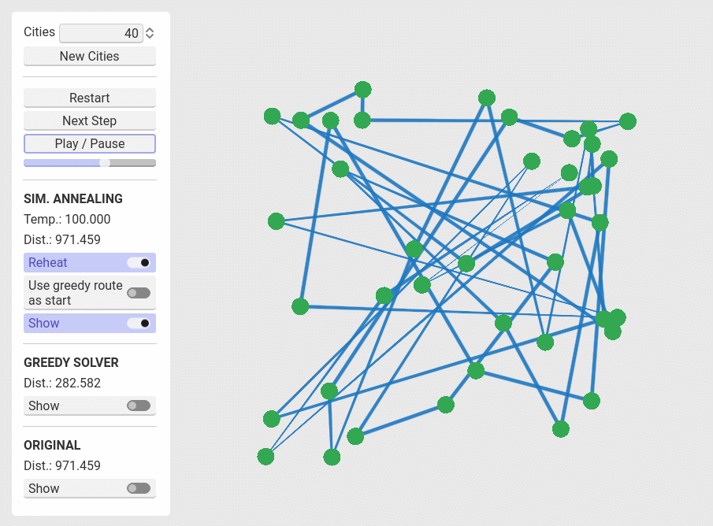
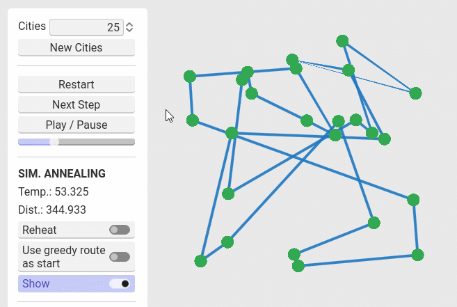
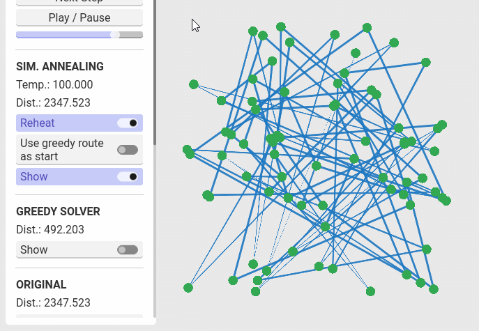

# Simulated Annealing TSP Solver

This project is an interactive visualisation of the travelling salesman problem (TSP) being solved by a [simulated annealing](https://en.wikipedia.org/wiki/Simulated_annealing) based algorithm. For comparison, it has the option to simultaneously display the solution generated by a [greedy algorithm](https://en.wikipedia.org/wiki/Nearest_neighbour_algorithm).

The app is made using Godot 4. The program logic is written in C# and the rendering is hardware accelerated.

## Getting Started

1. Download the latest version of the app from the [releases](https://github.com/Inspiaaa/TSP-Simulated-Annealing/releases) page.

2. Extract the files from the zip file.

3. Run the executable.

4. See the next section for usage instructions.

## Basic controls

- **Manually advance** the animation one logic step at a time by pressing the `Next Step` button.

- **Play the animation** by pressing the `Play / Pause` button. The speed of the animation can be changed via the slider found below the aforementioned button.

- **Reset** the animation by pressing the `Restart` button.
  
  

- **Generate a new TSP problem** by editing the number of cities at the top of the UI and then pressing the `New Cities` button. This will update the solution of the greedy solver and also reset the simulated annealing process.
  
  

- **Compare** the result obtained by the simulated annealing algorithm with the result of the greedy solver by ...
  
  - ... having a look at the round trip distances (See the `Dist.:` fields)
  
  - ... comparing the routes visually by showing / hiding the route of the greedy solver (use the `Show` check button)
  
  

### Camera controls

- **Zoom** in using the mouse wheel.

- **Move** the camera by holding down the middle mouse button and moving the mouse.
  
  

### Options

- By hovering over an option, a **tooltip** appears after a short delay.

- By selecting the `Use greedy route as start` option, the route obtained by the greedy algorithm will be used as the input and starting point for the simulated annealing process. This can lead to better end results in some cases.

- Sometimes when the temperature of the system is low, the algorithm converges on a local minimum and is unable to escape as this would require multiple ineligible operations which would temporarily increase the distance. To escape these minima, you can enable the `Reheat` feature, which increases the temperature parameter when it cools down to a predefined threshold (that can be set in the advanced settings).
  
  

### Advanced Settings

- At the bottom of the UI you will find the advanced settings that give you access to the internal parameters used by the simulated annealing algorithm.

- You can change all of the settings **on the fly**, without having to restart the simulation for them to take effect.

- Besides being able to customise the **starting temperature**, you can also change the **speed** at which it is reduced via the `Decay speed` slider. The resulting **temperature decay parameter**  that is used as the base of the internal exponential function that describes the temperature over time can be found in the `Information` section.

- The `Reheat Settings` let you configure the **threshold temperature** at which the "reheat" feature activates, as well as the temperature increase that it engenders.

- At the very bottom you can see the current **iteration number**.
  
  

### Example

50 cities, reheat enabled, using default advanced settings: 

